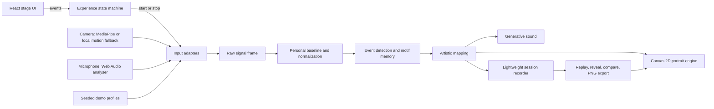

# Architecture

This document is the implementation contract for Pattern of One. It describes the target browser-only system; it is not, by itself, evidence that each behavior has been implemented or verified.

## Starting-point audit

The kickoff audit found a blank application repository: commit `4540b79` on `main` contained only `LICENSE`, with no package manifest, routes, or runtime to inspect. The Vercel alias `https://pattern-of-you.vercel.app` returned `DEPLOYMENT_NOT_FOUND` despite a separate build record marked `READY`. The implementation therefore starts as a focused greenfield build, and deployment completion includes binding and verifying the public alias rather than merely producing a successful build.

## Goals and fixed decisions

- Next.js App Router, React, and strict TypeScript provide a single immersive route and accessible interface.
- Canvas 2D is the required visual engine. The work must not depend on WebGL, a GPU-specific feature, or a server renderer.
- Camera and microphone features are processed locally after consent. MediaPipe Pose Landmarker is a lazy, optional enhancement, not a boot dependency.
- Web Audio supplies low-cost audio features and a restrained generated sound layer after a user gesture.
- A finite state machine controls the narrative. All live, movement-only, and demo inputs feed one signal-to-art pipeline.
- Seeded randomness and recorded normalized frames make synthetic sessions and replay deterministic.
- There is no backend, database, account, cloud media processing, required transcription service, or analytics layer.

Non-goals include identity, face recognition, emotion recognition, personality or health inference, raw-media recording, social ranking, a hosted gallery, and photorealistic or figurative representation.

## Runtime overview



The sensor clock, feature clock, and render clock are separate. Camera/pose inference may run at 10-20 Hz, audio analysis at a modest analyser cadence, and canvas rendering at the available display rate. The latest feature frame is smoothed between updates. React never receives a state update for every animation frame.

## Experience state machine

The public application has one route and these explicit stages:

```text
attract -> consent -> calibration -> session -> forming -> reveal
   ^          |            |            |          |         |
   |          +-- demo ----+            |          |         +-> compare
   |          +-- movement only --------+          |         +-> replay
   |          +-- denied/unavailable fallback -----+         +-> create another
   +----------------------- resetting <------------+---------+-> reset/exit
```

- **Attract:** an input-free seeded form responds only to pointer/touch. No media access occurs.
- **Consent:** the user chooses full media, movement only, or demo. Camera/microphone purposes and exclusions are explicit.
- **Calibration:** a 3-5 second sequence checks availability and establishes environmental and personal baselines through artwork changes, not a generic spinner.
- **Session:** three timed prompts progress from presence to memory to gesture over roughly 75-120 seconds. Only the prompt, quiet progress, status, mute, and exit surround the canvas.
- **Forming:** new prompts stop; early and late motifs are replayed and reconciled into a stable-but-living result.
- **Reveal:** the portrait, deterministic title, three evidence-backed observations, timeline/replay, PNG export, and new-session action appear.
- **Compare:** two local records receive equal visual weight and descriptive differences without scoring or categories.
- **Resetting:** the form collapses to its seed while all runtime resources and temporary data are released.

Permission denial is an event with recovery choices, not a terminal state. Exit from any active stage passes through the same cleanup routine. Focus is moved intentionally after every stage transition.

## Module boundaries

The exact filenames may evolve, but these responsibilities remain separate:

- **Experience controller:** reducer/state machine, stage timers, focus targets, and legal transitions.
- **Input adapters:** a common `SignalSource` contract for live full-media, movement-only, measured demo, and kinetic demo sources.
- **Camera features:** local pose landmarks when MediaPipe loads; otherwise downsampled pixel motion. Extract only motion, wrist/reach, head displacement, shoulder tilt, symmetry, proximity, stillness, and sudden deviation.
- **Audio features:** analyser RMS, smoothed loudness, activity, silence duration, envelope variation, onset/rhythm density, and conservative spectral variation.
- **Baseline model:** per-participant mean/variance, bounded normalization, multiple timescales, and reset.
- **Event and motif memory:** detects meaningful deviations and accumulates persistent gesture, pulse, stillness, fracture, and return motifs.
- **Mapping:** combines signals into energy, expansion, rhythm, continuity, symmetry, volatility, density, memory, silence, and illumination. It has no canvas or React dependency.
- **Portrait engine:** seeded Canvas 2D simulation, pooled points/traces, quality tiers, resizing, visibility handling, and frame capture.
- **Sound engine:** muted-by-default lifecycle and low-volume synthesized responses; no copyrighted audio assets.
- **Session model:** normalized frames, motifs, final parameters, title/observation evidence, and deterministic replay.
- **Export:** composes portrait, title, wordmark, and artistic-interpretation disclaimer into a PNG without a server round trip.
- **Debug adapter:** serializable snapshots and mock-profile controls, mounted only when `?debug=1` is present.

Components consume these services but do not duplicate their logic.

## Signal, baseline, and memory pipeline

Every source produces the same typed raw feature frame. Values are clamped and sanitized before entering the adaptive model. For each signal `x`:

```text
mean[t] = (1 - alpha) * mean[t-1] + alpha * x[t]
variance[t] = max(epsilon, smoothed squared deviation)
z[t] = clamp((x[t] - mean[t]) / (sqrt(variance[t]) + epsilon), -3, 3)
```

Calibration seeds the model so early noise does not look like a major event. Separate smoothing constants represent:

- immediate response: the latest moment;
- short-term behavior: several seconds used for prompt-level changes;
- session memory: persistent aggregates and motifs used during formation/reveal.

Mappings are structural, not emotional. Movement may increase flow velocity, reach may expand radius, stillness may crystallize traces, silence may open negative space, and vocal activity may create illumination pulses. Several inputs are combined into a smaller artistic parameter set, avoiding a one-slider-per-feature visualizer.

Events retain their supporting signal, threshold, prompt, and time. The reveal's title and observation rules operate on these summaries. Debug mode may show evidence such as `gesture expansion +0.31 after prompt 2`; public copy only shows the corresponding careful observation.

## Determinism and demo mode

All pseudo-random choices come from a session seed. Simulation uses elapsed session time rather than wall-clock dates. Given the same seed and normalized frame sequence, the mapping, motif decisions, title, observations, replay, and final portrait must match.

Demo mode is an input adapter, not alternate artwork:

- **Measured:** lower movement, longer pauses, and gradual changes.
- **Kinetic:** frequent reach/gesture events, faster rhythm, and greater variation.
- **Contrasting pair:** runs measured and kinetic records through the full pipeline and opens comparison.

Demo sessions perform calibration, prompts, formation, reveal, replay, export, and reset through the normal state machine. Development controls may scrub profiles in `?debug=1`; normal presentation never exposes metrics.

## Canvas 2D portrait engine

The engine owns long-lived typed arrays/object pools and a seeded PRNG. `requestAnimationFrame` mutates and draws the scene without routing particle state through React.

Layer order is intentional:

1. near-black tonal field;
2. uncertain seed/living core;
3. short-lived gesture traces;
4. voice/rhythm pulse structures;
5. persistent memory filaments;
6. silence-created gaps and crystallization;
7. restrained bloom-like accents composed with Canvas 2D blending.

The silhouette remains abstract and non-figurative. No layer may resolve into a face, body, brain, animal, galaxy, or waveform. Earlier motifs are redrawn during formation, so the final state is synthesized rather than the last live frame frozen.

Quality tiers adjust particle count, trace count, blur radius, sampling cadence, and pixel-ratio cap:

- **High:** richer pools and up to a conservative `devicePixelRatio` cap.
- **Balanced:** default desktop/tablet fidelity.
- **Low:** simplified compositing, fewer particles/traces, and a tighter mobile DPR cap.

Automatic selection uses device capability and sampled frame time, with an unobtrusive manual override. `visibilitychange` pauses or lowers work; resize preserves composition and avoids reallocating every frame.

## Audio architecture

One user gesture may create/resume an `AudioContext`. The analyser extracts features from the microphone stream locally. A separate minimal synthesis graph uses oscillators/noise buffers, filters, and gain envelopes to echo rhythm, movement, silence, and recurring motifs.

The master gain begins at a safe level, ramps rather than jumps, and never produces harsh peaks. Mute is always available and retained for the current session. If audio input or output is absent, the visual mapping remains complete and non-audio status communicates progress. Reset disconnects nodes, stops sources, and closes/suspends the context as appropriate.

## Session data, replay, compare, and export

A session record contains only what is needed to reproduce the artwork: version, seed, input mode/profile, accent, normalized parameter frames at a capped cadence, motif summaries, title, evidence-backed observations, duration, and final parameters.

- Raw camera frames and audio samples are never added to records.
- Raw transcripts are never stored. Optional speech support may hold a small derived recurring-word set in memory, then discard it on reset.
- The current and previous lightweight records may be kept locally to enable compare. There is no automatic remote sync.
- Replay advances through recorded normalized frames on a deterministic clock.
- Compare renders each record independently with equal scale; differences are descriptive, never ranked.
- PNG export redraws a clean export composition and includes the title, Pattern of One wordmark, and artistic-interpretation disclaimer.

Reset clears both in-memory and temporary local session state when the user asks for a full reset. Creating another may retain exactly one prior derived record for comparison, with a visible way to clear it.

## Privacy and lifecycle boundary

Media access is impossible before an explicit consent action. Camera frames remain attached to an in-memory video element and are consumed only by local landmark or motion analysis. Microphone samples remain in the local Web Audio graph. MediaPipe model assets may be fetched as static code/model files, but participant media is never sent with that request.

The application has no media upload endpoint, API key, server transcription call, tracking pixel, account identifier, or analytics event. It does not inspect facial identity or infer emotion, protected traits, personality, or mental state.

A single idempotent cleanup path must:

1. cancel animation frames and timers;
2. stop every `MediaStreamTrack`;
3. disconnect analysers and synthesis nodes and close/suspend audio;
4. dispose the pose landmarker and detach the video stream;
5. revoke temporary export URLs;
6. remove listeners and observers;
7. clear signal buffers, motifs, derived language, diagnostics, and requested local records.

Cleanup runs on reset, early exit, fatal input error, component unmount, and page lifecycle transitions where practical.

## Graceful degradation

| Condition | Required behavior |
| --- | --- |
| Camera denied/unavailable | Offer voice-supported continuation, movement-only retry where meaningful, or demo mode. |
| Microphone denied/unavailable | Continue with movement; never block calibration indefinitely. |
| MediaPipe load/inference fails | Switch to local pixel-motion features and disclose reduced sensing. |
| No/multiple participant or low light | Give calm positioning/light guidance, allow continuation or demo. |
| Noisy environment | Recalibrate baseline or continue with movement-weighted mapping. |
| Speech API unavailable | Omit language-derived motifs/title influence without changing core flow. |
| Audio output blocked | Stay muted until gesture; visual status remains complete. |
| Low frame rate | Step down quality and inference cadence before reducing interface responsiveness. |
| Export failure | Preserve the reveal and offer retry; never lose the session automatically. |
| Reduced motion | Slow velocities, simplify transitions, and retain gradual memory/state change. |

## Accessibility and responsive behavior

The DOM, not the canvas, carries headings, prompts, status, controls, error text, and privacy explanation. Controls are semantic, keyboard reachable, visibly focused, screen-reader named, touch sized, and ordered predictably. Stage transitions set focus without stealing it during active interaction. Sound has no exclusive information channel, prompts are always text, and no effect flashes at high frequency.

Desktop prioritizes generous negative space and edge controls. Tablet keeps prompts clear at arm's length. Mobile reduces visual complexity, caps DPR, uses `svh`, keeps controls in thumb-safe regions, and preserves a legible reveal instead of shrinking the desktop composition. Required review sizes are 1440x900, 1280x720, 1024x768, 768x1024, 390x844, and 360x800.

## Verification architecture

- **Vitest:** baseline/variance/normalization, event thresholds, motif memory, mapping, seeded PRNG, demo playback, title and observation evidence, session serialization, and cleanup helpers.
- **Component tests:** semantic controls, state transitions, focus, consent copy, denial recovery, and debug gating.
- **Playwright:** every stage and input mode, mocked media success/failure, calibration and prompts, early exit, formation/reveal, replay, PNG download, second portrait, compare, reset, reduced motion, keyboard, and mobile flows.
- **Visual QA:** screenshots of every state at all required viewports; check overlap, contrast, reachable controls, canvas resizing, console errors, hydration warnings, and performance regressions.
- **Privacy QA:** confirm no media request before action, no network request containing media, no raw media/transcript persistence, and stopped device indicators after exit/reset.
- **Release gate:** lint, strict type check, unit/component tests, Playwright, production build, local production smoke test, then live Vercel alias verification.

Deployment is a static/browser runtime concern. Environment variables are unnecessary for the core system; if optional services are ever added, secrets stay server-side and the local signal-only experience remains the default fallback.
